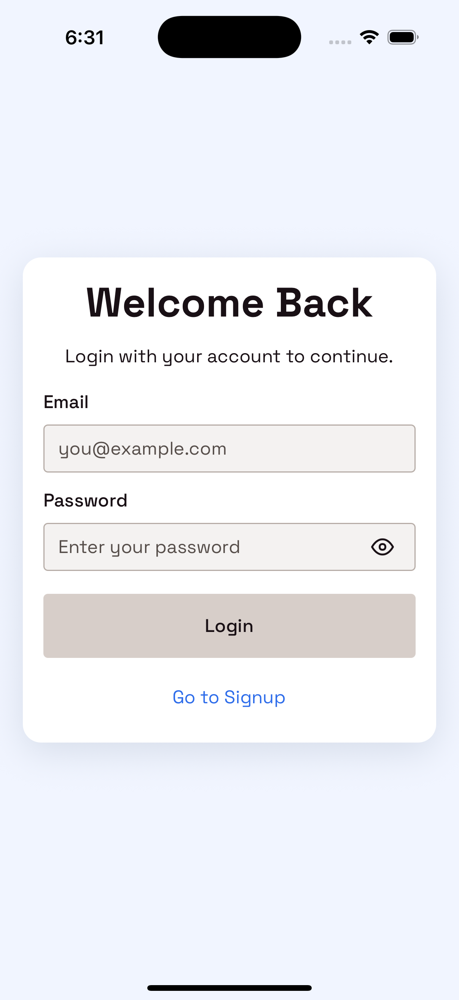
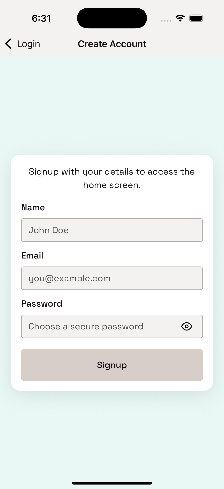
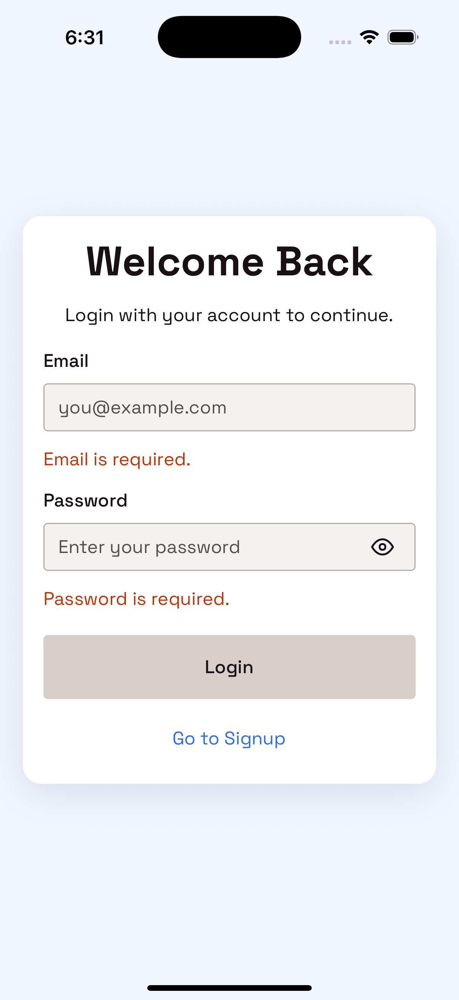
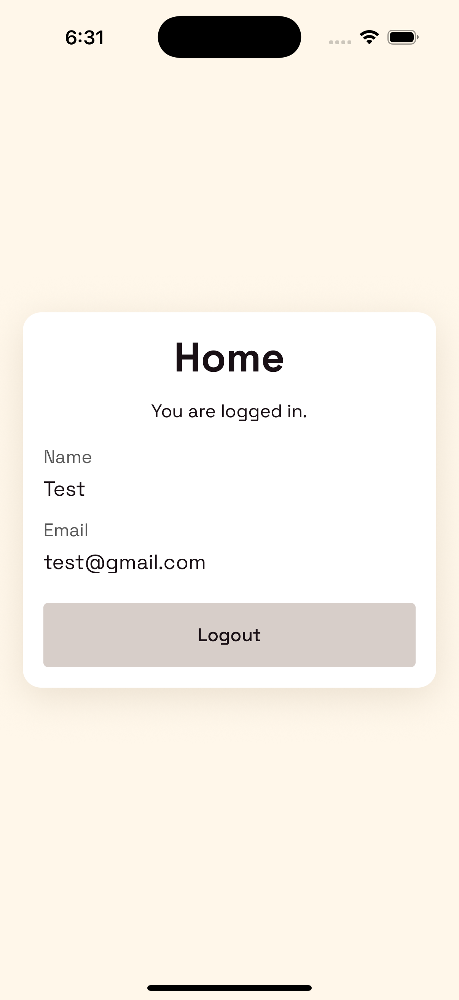
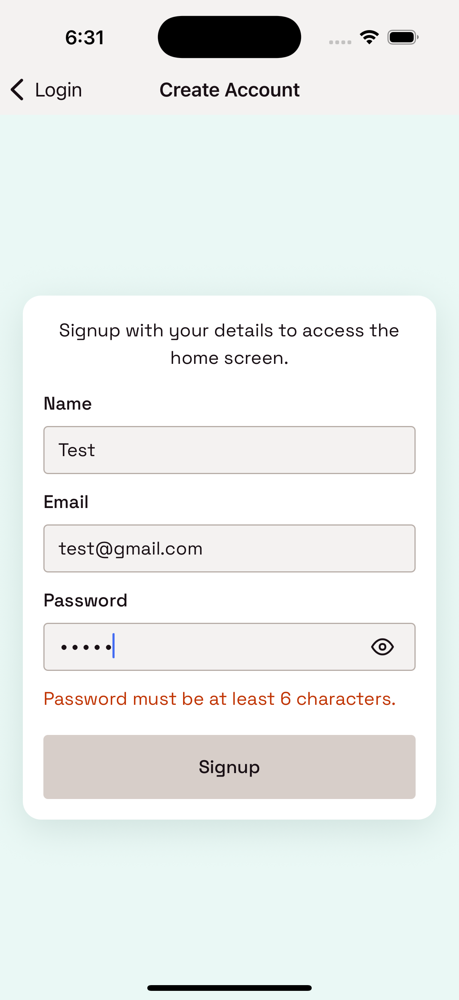

# User Authentication App (Expo + React Native)

Simple authentication app built with React Native and Expo.

## About Ignite Boilerplate

This project is based on [Ignite](https://github.com/infinitered/ignite), Infinite Red's battle-tested React Native boilerplate.

- Official repo: <https://github.com/infinitered/ignite>
- Full docs: <https://docs.infinite.red>
- Ignite CLI quick start:

```bash
npx ignite-cli@latest new MyApp
```

Ignite provides proven defaults for Expo + TypeScript apps (navigation, theming, i18n, testing, generators, and dev tooling).  
This app keeps the Ignite foundation and customizes the auth flow for this assignment.

## Implemented Features

- `AuthContext` using React Context API as the only state-management layer.
- `Login` screen (Formik + Yup):
  - Email + password inputs
  - Validation for invalid email/password format
  - Incorrect-credentials error handling
  - Navigate to Signup
- `Signup` screen (Formik + Yup):
  - Name + email + password inputs
  - Missing-field validation
  - Invalid email validation
  - Password length validation (`>= 6`)
  - Navigate to Login
- `Home` screen:
  - Shows logged-in user name and email
  - Logout support
- Navigation flow using React Navigation:
  - `Login`
  - `Signup`
  - `Home`
- Optional auth persistence implemented using local storage (`@react-native-async-storage/async-storage`).
- Password visibility toggle on Login and Signup.

## Screenshots

- [Login](assets/screenshots/login.png)  
  
- [Signup](assets/screenshots/signup.png)  
  
- [Login Validation](assets/screenshots/login-validation.png)  
  
- [Home](assets/screenshots/home.png)  
  
- [Signup Validation](assets/screenshots/signup-validation.png)  
  

## Project Structure (Auth-related)

```text
app/
  features/
    auth/
      AuthContext.tsx
      authValidation.ts
      types.ts
  screens/
    LoginScreen.tsx
    SignupScreen.tsx
    HomeScreen.tsx
    __test__/
      AuthFlow.test.tsx
```

## Run Locally

```bash
pnpm install
pnpm run start
```

## Test and Quality Commands

```bash
pnpm run compile
pnpm run lint:check
pnpm test --runInBand
```

## Test Coverage Scope

- Unit tests:
  - `authValidation` logic
  - `AuthContext` auth actions (`signup`, `login`, `logout`, duplicate checks)
- UI/integration tests:
  - Full auth flow (`Login -> Signup -> Home -> Logout`)
  - Form validation and incorrect credential messaging
